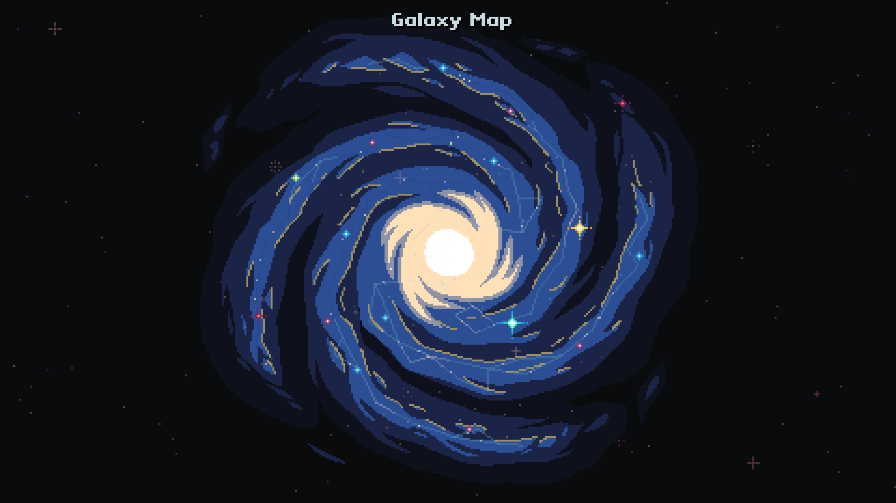

# Galaxy Map

A small experiment in making something that looks like it could be pixel art in Godot 4.4

A hosted WebGL build should be found [here](https://alanlawrey.me/galaxy-map). It is definitely *NOT* optimised for mobile use.

Internally it's making use of a few different techniques:
- It runs at a native 480x270 resolution.
- Simple sprite sheets for animating stars.
- Vector graphics for the layers of the galaxy.
- 3D meshes for the wireframe scan lines of each object that can be clicked on.
- Raymarched SDFs for the final visual of each object.

## Author
Alan Lawrey 2025